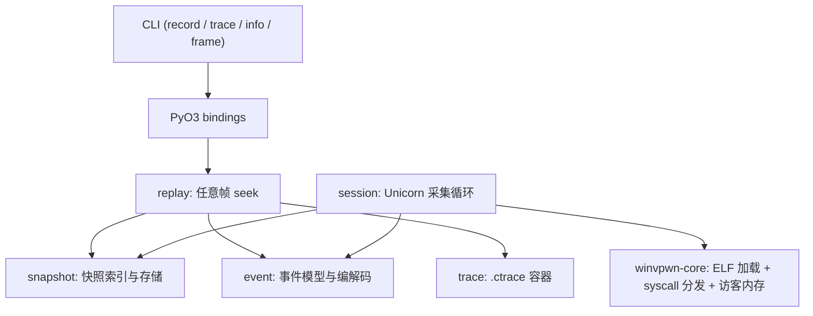

# 放映机：Stage 1 设计文档

> 本文锁定 Stage 1（采集与回放内核）的数据结构与算法。Stage 1 不含 UI，不含 LLM，
> 只有确定性引擎。后续阶段的界面与标注层在这一层之上构建。

## 1. 产品定位

把一个二进制程序的执行过程变成**可回放、可定位、可讲述**的叙事。

现有工具的问题不在功能缺失，而在表达形态：`strace` 是顺序日志，`gdb` 是断点式
调试，各类 trace viewer 是平面表格。它们能回答"发生了什么"，很难回答"当时是什么
样子"——某一帧的寄存器、内存、调用栈、以及它和前后帧的关系。

放映机要解决的是后者。核心能力是一句话：**任意一帧都可以瞬间回去看**。

## 2. 形态

| 形态 | 职责 | 阶段 |
| ---- | ---- | ---- |
| CLI | 采集、导出、批处理、CI 冒烟 | Stage 1 |
| TUI | 交互主界面（Textual） | Stage 2 |
| HTML 静态导出 | 分享与归档 | Stage 3 |
| Agent 对话层 | 受控工具驱动的取证问答 | Stage 4 |

不做实时 Web 应用，不做原生 GUI。理由见立项讨论：交付链路与 winVpwn 对齐，
Windows / Linux 零额外成本。

## 3. 术语

- **帧（Frame）**：执行历史中的一个离散位置，从 0 开始单调递增。一个帧对应
  事件流中的一个事件。
- **事件（Event）**：执行过程中发生的一次可观测变化（指令执行、寄存器写入、
  内存写入、系统调用、程序输出、终止）。
- **快照（Snapshot）**：某一帧的完整可恢复状态（寄存器 + 被写过的内存页 + 输出
  长度）。快照是重建任意帧的锚点。
- **轨迹（Trace）**：一次完整执行的帧号、事件流与快照索引的集合。
- **重放（Replay）**：从最近快照出发，按事件流推演到目标帧的过程。

## 4. 架构



`session` 负责真实采集，`replay` 负责事后重建，两者共享同一套事件模型与同一份
`MachineState::apply`。`trace` 是容器层，只做序列化。

## 5. 复用策略

放映机不重新发明 ELF 加载与系统调用翻译：

- **复用**（git 依赖 `winVpwn`，固定在发布 tag `v0.1.0`）：
  - `winvpwn_core::elf::load_elf` —— 镜像解析与校验（错误码 E001-E007）
  - `winvpwn_core::syscall::Dispatch` —— Linux x86_64 调用号路由与 errno 语义
  - `winvpwn_core::vkernel` —— 虚拟进程上下文、访客内存抽象、输出捕获
  - `winvpwn_core::cpu::unicorn_engine` —— 栈布局常量
- **自研**：
  - 指令级采集循环（winVpwn 只需要 syscall 级拦截，放映机需要每一帧）
  - 事件模型、快照、回放引擎、`.ctrace` 容器

依赖固定在 winVpwn 的发布 tag 上，升级显式进行，避免被上游的进行中改动拖累。

## 6. 事件模型

事件是不可变记录，一旦写入不再修改。用枚举表达，非法状态不可构造。

```rust
pub struct Frame(pub u64);

pub enum Event {
    // 一条指令执行完毕，携带原始编码，供消费端自行反汇编
    Insn { addr: u64, size: u8, bytes: Vec<u8> },
    // 寄存器被写入
    RegWrite { reg: RegId, value: u64 },
    // 内存区间被写入
    MemWrite { addr: u64, data: Vec<u8> },
    // 系统调用进入（保留 ABI 寄存器快照）
    SyscallEnter { nr: i64, name: String, args: [u64; 6] },
    // 系统调用返回
    SyscallExit { ret: i64 },
    // 程序产生输出
    Output { data: Vec<u8> },
    // 进程终止
    Exit { kind: ExitKind, value: u64 },
}
```

设计约束：

- **每个事件都携带重建所需的全部信息**。`MemWrite` 带写入的字节，`RegWrite` 带
  写入的值，回放时不需要再次执行指令，只做状态叠加。
- **不记录只读操作**。读取内存、读取寄存器在重建时从状态里查，不占事件预算。
- **帧号即事件序号**。`Frame(n)` 表示"第 n 个事件之后的状态"，语义唯一。

## 7. 快照与回放

### 7.1 为什么需要快照

从第 0 帧顺序重放到第 N 帧，复杂度 O(N)。在长轨迹（百万级事件）里，反向单步
会退化成 O(N²)。快照把重建的起点尽可能靠近目标帧。

### 7.2 快照内容

```rust
pub struct Snapshot {
    pub frame: Frame,
    pub regs: RegFile,
    // 完整的已捕获输出，重建时不需要重放 Output 事件
    pub output: Vec<u8>,
    // 只包含"到本帧为止被写过"的页，未触碰的页不需要保存
    pub dirty_pages: Vec<(u64, Page)>,
}
```

只保存被写过的页（dirty page）。一个只做计算的程序，内存快照几乎为空；这比
每帧全量内存转储小几个数量级。

### 7.3 采集时的快照策略

几何增长间隔：每 K 个事件取一个快照，K 从 1024 起步，轨迹达到 `K * 64` 时 K 翻倍，
上限 `2^20`。快照总数对数级于事件数，任意帧的重放距离被当前 K 上界锁死。

### 7.4 任意帧 seek

```
seek(target):
    snap = 不超过 target 的最近快照
    state = snap.restore()
    for frame in (snap.frame, target]:
        state.apply(event[frame])
    return state
```

重建后的状态是只读视图。要"实时执行到某帧"，用同一个入口，只是把 apply 换成
真实事件叠加，不调用 Unicorn。

### 7.5 反向单步

反向单步就是 `seek(current - 1)`。正确性依赖一个前提：**回放路径与应用路径
严格一致**。因此回放状态的 apply 实现与采集时的记录实现共用同一份状态机代码，
避免两套逻辑漂移。

## 8. 确定性假设

回放正确性建立在确定性上：给定相同镜像、相同输入、相同初始内存，Unicorn 的
执行序列可复现。Stage 1 的所有系统调用都是纯内存操作（无宿主 I/O），因此满足。

Stage 2 引入文件/标准输入后，必须把外部输入也纳入轨迹（记录读入的字节），
才能保持重放确定性。这一点在数据格式里预留字段。

## 9. 存储格式

自定义二进制格式 `.ctrace`，无分块索引（seek 走内存中的快照数组，文件只落盘一次）：

```text
magic       "CTRC"          4 bytes
version     u16 LE          格式版本，当前 1
arch        u8              0 = x86_64
flags       u8              保留
entry       u64 LE          采集时的程序入口
image_hash  [u8; 32]        SHA-256，校验轨迹与镜像匹配
initial     [u64; 18] LE    帧 0 的寄存器
--- 正文（小端 + varint）---
base        varint 页数，逐页 [addr varint][4096 bytes]，按地址升序
events      varint 条数，逐事件 [tag u8][字段]
snapshots   varint 个数，逐快照 [frame varint][regs][output][dirty pages]
checksum    u64 LE          FNV-1a 全文校验（不含自身）
```

所有变长整数走 uvarint（有符号数用 zigzag），事件类型用单字节 tag。选二进制而
非 JSON 的原因：事件量级在百万级，JSON 的体积与解析成本都不可接受。

## 10. 复盘四类历史问题，Stage 1 如何结构性规避

| 历史问题 | Stage 1 的对策 |
| -------- | -------------- |
| 一堆 BUG | 本阶段没有 LLM，没有异步，没有网络；核心是纯函数式的事件 apply；每个模块有单元测试 |
| AI 不能用工具 | 工具层在 Stage 1.5 用假决策器驱动完成测试，接入真实模型前就已经测穿 |
| 全是假数据 | 事件全部来自真实 Unicorn 执行；CI 冒烟测试跑真实 ELF 全链路 |
| UI 难看、AI 味 | Stage 1 无 UI；Stage 2 复用 winVpwn 的低饱和主题，渲染与数据分离 |

## 11. Stage 1 范围

**做**：

- `event` 事件模型与编解码
- `session` 指令级采集循环（复用 winVpwn 引擎）
- `snapshot` 快照生成与 dirty page 追踪
- `replay` 任意帧 seek、反向单步
- `.ctrace` 读写
- PyO3 绑定：`record_elf` / `load_trace` / `replay_frame`
- CLI：`cinema record` / `cinema trace` / `cinema info` / `cinema frame`

**不做**（留给后续）：

- 任何 UI
- LLM 标注与 Agent
- 文件系统、网络、信号类系统调用
- PIE 与动态链接

## 12. 验收标准

Stage 1 完成的判据，全部可自动化验证：

1. 对 fixture `hello_static` 采集出完整轨迹，事件数与指令数一致。
2. `seek(n)` 重建的状态与真实执行到第 n 帧的状态逐字节一致（寄存器 + 内存 + 输出）。
3. 反向单步 100 帧后，各帧状态与正向重建结果一致。
4. `.ctrace` 落盘后重新加载，seek 结果不变。
5. `cargo test --no-default-features` 全绿，`cargo clippy -D warnings` 无告警。
6. Python 侧 mypy strict 通过，pytest 全绿。

> 完成状态（2026-09-16）：1-6 全部达成。Rust 单测 49 个，Python 侧 pytest 覆盖
> `src/cinema` 达 90%；Rust 侧 `reverse_stepping_is_consistent_with_forward_replay`
> 覆盖第 3 项，`roundtrip_preserves_everything` 覆盖第 4 项。
